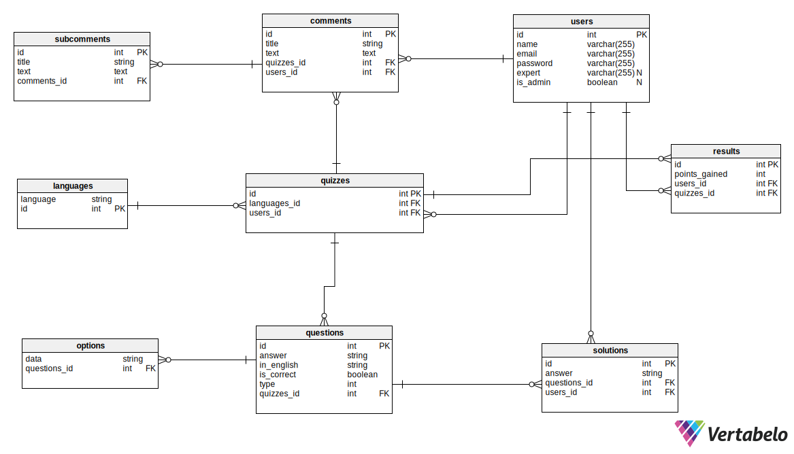

# Project description
This is the language platform project.  
It was fully developed by four students from Cracow, with the use of **PHP Laravel Framework**.  
The page gives few possibilities to get better in choosen language.  
For example:  
**1. You can create multiplie types of quizess**  
**2. Add new languages**  
**3. Achieve expert badges**  
**4. And more yet to come...**  

# Getting started
## Configuration
Please check the official laravel installation guide for server requirements before you start. [Official Documentation](https://laravel.com/docs/5.4/installation#installation "Official Documentation").  
Alternative installation is possible without local dependencies relying on [Docker](https://www.docker.com/ "Docker").

## To start working with page you must execute the following steps:  

1. Clone the repository:  

```
git clone https://bitbucket.org/starzyk_bartlomiej/php_2020_platforma_do_nauki_jezykow/src/master/ 
```   
2. Start database:  
```python
! docker run --name=mysql --net=host --rm --env MYSQL_ROOT_PASSWORD=root123 --env MYSQL_DATABASE=test --env MYSQL_USER=test --env MYSQL_PASSWORD=test123 -d mysql/mysql-server:8.0
```
3. Connect with host:  
```python
! while ! timeout 1 bash -c "echo > /dev/tcp/localhost/3306" 2> /dev/null; do sleep 1; done; echo "Done.";
```
4. Go to project directory:  
```python
%cd project  
```
5. Install composer:  
```python
! composer install
```
6. Replace .env file:  
```python
! cp .env.example .env
```

7. Generate artisan key:  
```python
! php artisan key:generate
```
8. Refresh migration:  
```python
! php artisan migrate:fresh
```
9. Add seed:  
```python
! php artisan db:seed
```
10. Create dump.sql to tests:  
```python
! docker exec mysql mysqldump -u root --password=root123 test > tests_codeception/_data/dump.sql
```
11.  Execute unit tests:  
```python
! vendor/bin/phpunit
```
12.  Start Server:  
```python
import subprocess
artisanServe = subprocess.Popen(['php', 'artisan', 'serve', '--port', '8888'])
```
13.  Run codeception tests:  
```python
! vendor/bin/codecept run
```
## Cleaning procceses:  
1. Stop server:
```python
! killall php php7.4
```
2. Go to previous directory:
```python
%cd ..
```
3. Stop database:
```python
! docker container stop mysql
```


# Database scheme

# Code overview  
## Folders:
- <em>app - Contains all the Eloquent models</em>
- <em>app/Http/Controllers/Api - Contains all the api controllers</em>
- <em>app/Http/Middleware - Contains the JWT auth middleware</em>
- <em>app/Http/Requests/Api - Contains all the api form requests</em>
- <em>config - Contains all the application configuration files</em>
- <em>database/factories - Contains the model factory for all the models</em>
- <em>database/migrations - Contains all the database migrations</em>
- <em>database/seeds - Contains the database seeder</em>
- <em>routes - Contains all the routes</em>
- <em>tests - Contains vendor tests</em>
- <em>tests/tests_codeception/acceptance - Contains all the codeception tests</em>
 ## Environment variables:
```
.env
```
 - Environment variables can be set in this file
Note : You can quickly set the database information and other variables in this file and have the application fully working.
